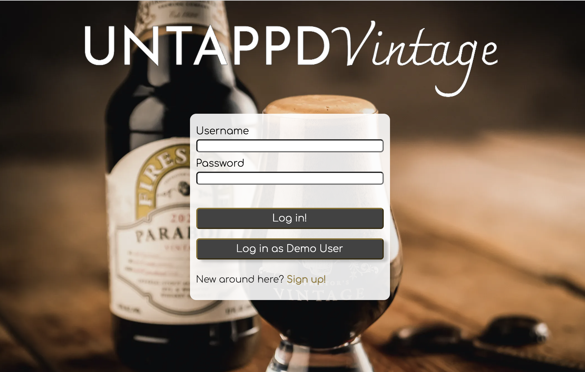
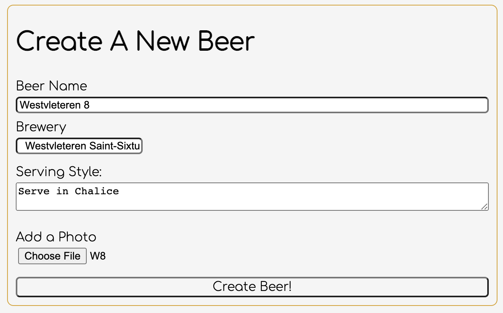

# UNTAPPDVintage

UNTAPPDVintage is a site for beer lovers to connect and exchange information about their experiances with aging beers.  Cant decide to enjoy something soon or celler it for a few years?  This is your information hub!  Share your thoughts and experiances (and pictures!), and look to see what other people have to say.

Curious about what people have to say? Take a look now at the [live site](https://untappd-vintage.herokuapp.com/#/)!



## Features

Anyone who wants to see the site is able to:
- view the reviews index page
- view the beers index page
- browse specific reviews and beers
- create an account, or log in with the demo-user account or an existing personal account

Logged-in users can:
-	create a new beer if they cannot find it in the site's database
-	update or delete beers that they created
-	create, update, or delete their own reviews



## Technologies

UNTAPPDVintage has a backend framework of Ruby on Rails, using a PostgreSQL database.  Its frontend is Javascript, react and redux.  SCSS was used for styling, and the image assets are stored and accessed on AWS S3.  

## Special Features

### Combo box
I decided to implement a combo box for user input when they are searching beers or breweries.  I chose this instead of a regular dropdown menu because it will be faster easier for the user to find the beer / brewery they are after, especially as the database grows.  The combo box is set to pull all information for the feild in the database, so if a user adds a new beer, they will be able to find it in the combo box right away.  

This is also beneficial for the organization of the database - syntax differences (for instance "St. Bernardus" vs "Saint Bernardus" will result in two versions of the same beer in the database.


### Translating user input 
In order to simplify filtering and data analysis later, I decided to include a lot of joined tables in my schema.  Because of this, I needed to use entity IDs instead of names when creating new beers or reviews.  However, I don't expect a user to type in a Brewery ID when they only know the name.  To fix this, I included some methods to translate user input strings to find the correct ID in the database.  

```javascript 
    findVintage(yr) {
        let arr = this.props.vintages

        let obj = arr.find(vin => {
            return vin.year === yr
        })
        return obj
    }
```


## Coming Soon!!  
-  Users can create Breweries with associated beers
-  A flavor profile table will be added to reviews so users can click flavors, and eventually search by flavor profiles
-  Beers will display their average rating as a whole, and the highest rated aged years.  
-  Reviews will include the age of the beer when the review was created
-  User profiles will be added, and connections to friends will be an extra feature

# Thanks for visiting.
